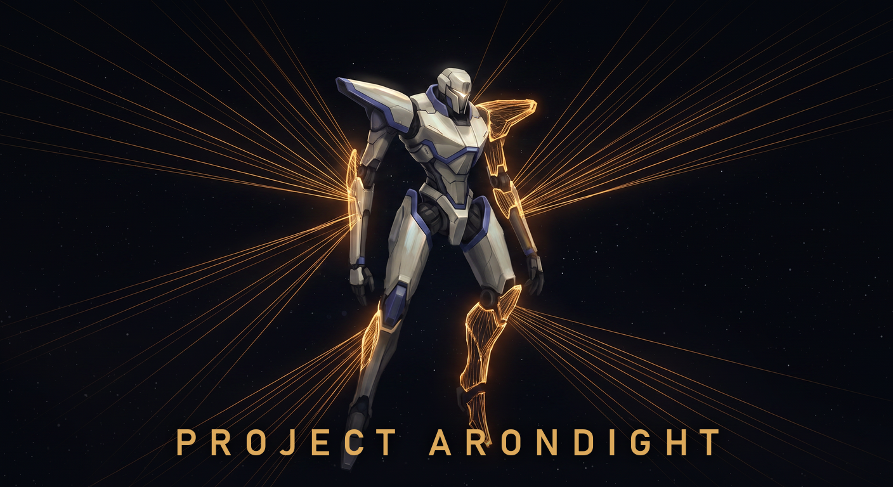
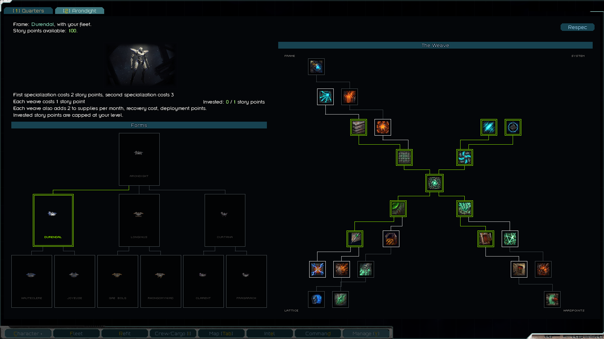
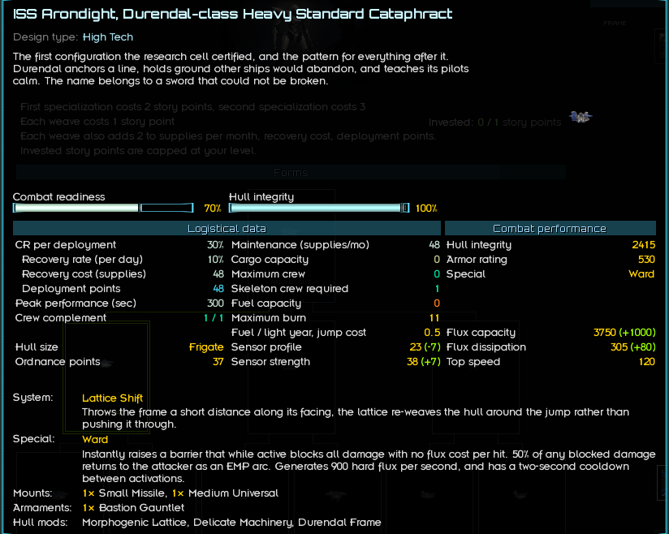
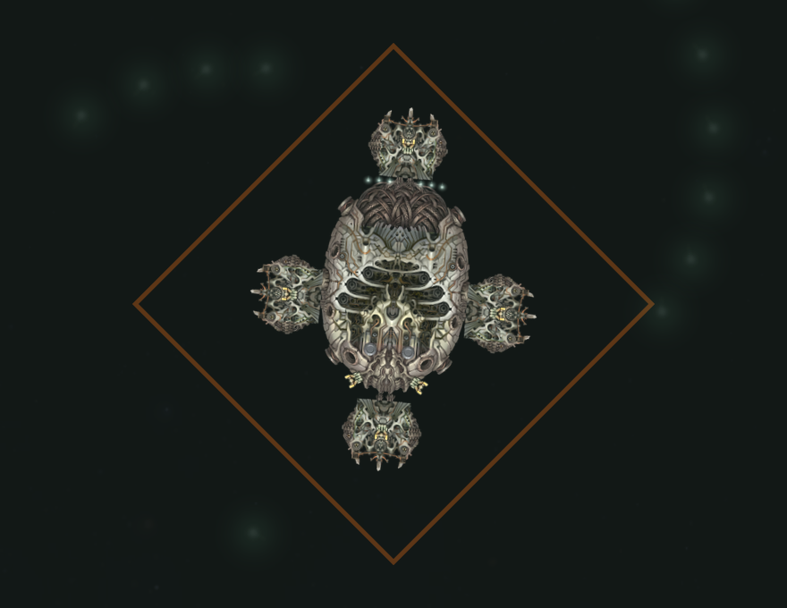
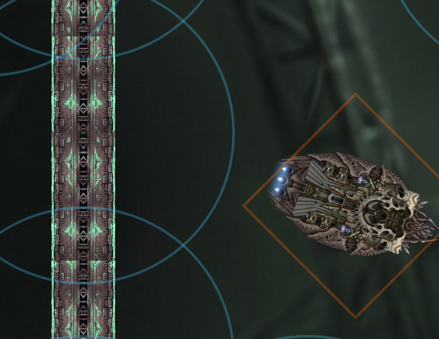

# Project Arondight
> The lattice grows the hull to fit its pilot. Nobody has asked what it grows the pilot to fit.
> - Research cell minutes, unfiled

A crewed mech super-frigate, recovered from a derelict research habitat, and the missions around it. The frame's lattice re-grows the hull into nine certified configurations, named for the blades and lances of Old Earth legend. Durendal holds the line. Longinus shoots from outside the battle. Curtana closes, touches, and holds.

Upgrades weave into the frame node by node, down two trees. A quest chain delivers the frame and pushes further out from there.

Spoilers for [THREAT].

No required dependencies. Optional integration with Arma Armatura and LunaLib. Can be added to existing saves.

Forum link: TODO (no thread yet; when it goes up, update this link and modThreadId in arondight.version)

## Screenshots

